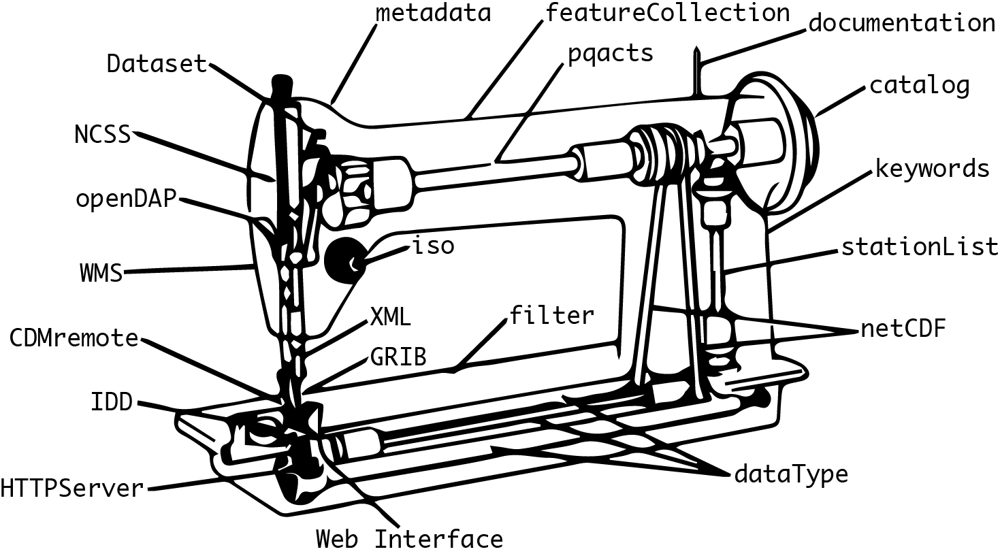

# TDSewing Machine

Web utility to stitch together configurations for [THREDDS data servers](http://www.unidata.ucar.edu/software/thredds/current/tds/). Unidata team
members can manage datasets and feature collections that are available to users. Users can configure their TDS instances and
download the necessary configuration files to get their server up and running. **This project is under development and not yet
intended for production use.**
